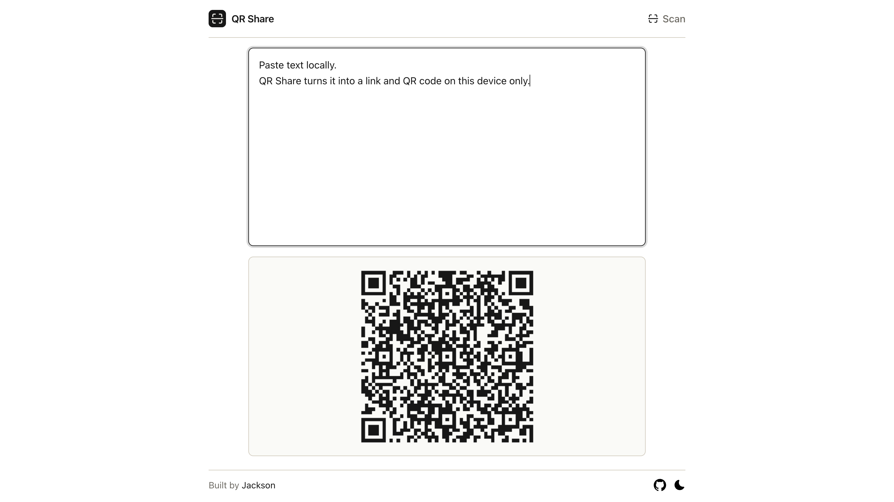
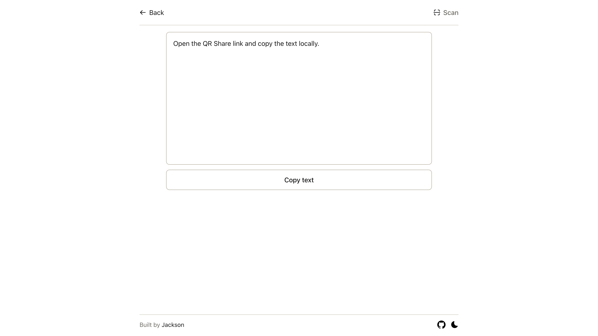

# QR Share

QR Share is a small open-source PWA for handing off short text and URLs between nearby devices with QR codes.

It creates app-specific URLs like `/view#v1.p.<payload>`, renders them as QR codes, and decodes them locally on the receiving device. There is no backend, no account system, and no cloud storage.

Live demo: [https://jacksoncurrie.github.io/qrshare/](https://jacksoncurrie.github.io/qrshare/)

## Why This Exists

QR Share is intentionally narrow in scope:

- share short text, links, codes, and snippets between nearby devices
- work offline after the first successful load
- avoid servers, sign-ins, syncing, and analytics
- stay simple enough to audit and maintain

It is not trying to be a secret-sharing tool, a file transfer app, or a general QR utility suite.

## Features

- Enter short text and generate an app-specific QR Share link automatically.
- Switch to URL mode and generate a direct QR code for any valid `http` or `https` link.
- Render that link as a QR code and copy the generated link directly from the QR area.
- Open a QR Share URL directly and decode the payload locally.
- Scan QR Share codes with the device camera.
- Copy the decoded text with one click.
- Install and reuse the app offline after it has been cached once.

## Screenshots

### Create



Type once, or switch to URL mode, and get the QR code immediately. The QR area also acts as the copy target for the generated link.

### View



Open a QR Share payload locally and copy the decoded text.

## How It Works

QR Share v1 uses a simple payload format:

```text
v1.p.<payload>
```

- `v1` is the protocol version
- `p` means plain-text mode
- `<payload>` is UTF-8 text encoded as URL-safe base64 without padding

The app generates full URLs that look like:

```text
/view#v1.p.<payload>
```

The payload lives in the URL fragment, which means it is not sent in normal HTTP requests. That improves privacy, but it does not make the content secret.

## Privacy And Security Model

- No accounts
- No backend
- No analytics
- No ads
- No server-side storage
- No long-term persistence of generated payloads by default

Important caveats:

- Anyone with the QR code or link can read the content.
- QR Share is not suitable for high-value secrets in public settings.
- Camera access is only requested when the user enters the scan flow.
- The scan flow only accepts QR Share payloads, not arbitrary QR content.

See [SECURITY.md](SECURITY.md) for reporting guidance and security boundaries.

## Limits And Caveats

- Create mode supports plain text payloads and direct `http`/`https` URLs.
- Payloads above 800 UTF-8 bytes are blocked.
- QR Share only accepts app-specific QR payloads in the in-app scan and view flows.
- First-time visitors who are fully offline cannot load the app until it has been cached once.
- Camera scanning depends on `getUserMedia` support and user permission.

## Browser Support

QR Share targets current evergreen browsers:

- Chrome
- Edge
- Firefox
- Safari

Camera scanning depends on browser camera support and device permissions. The create and direct-view flows still work without camera access.

## Tech Stack

- Vue 3
- TypeScript
- Vite
- Vue Router
- Vitest + Vue Test Utils
- Playwright
- ESLint + Prettier
- `vite-plugin-pwa`
- GitHub Actions
- GitHub Pages

## Local Development

```bash
npm ci
npm run dev
```

The default development server runs at `http://localhost:5173`.

## Available Scripts

```bash
npm run dev
npm run build
npm run preview
npm run lint
npm run check
npm run verify
npm run format
npm run typecheck
npm run test:unit
npm run test:e2e
```

## Testing

QR Share includes unit, component, and browser-level tests.

```bash
npm run check
npm run verify
npm run test:e2e
```

Notes:

- `npm run check` runs linting plus Vue/TypeScript typechecking.
- `npm run verify` runs the main non-browser verification pass: check, unit tests, and production build.
- Playwright runs against a production preview server.
- The scanner flow is tested with a deterministic mock instead of a real camera in CI.
- `npm run build` is part of the expected verification flow before release.

## Deployment

Production is designed for GitHub Pages.

- The production base path is `/qrshare/`.
- `npm run build` also copies `dist/index.html` to `dist/404.html` for SPA fallback support on GitHub Pages.
- CI and deployment workflows live in [ci.yml](.github/workflows/ci.yml) and [deploy.yml](.github/workflows/deploy.yml).

## Accessibility

- Keyboard accessible controls and navigation
- Semantic labels on all inputs and buttons
- Clear inline error messaging and visible focus styles
- Strong contrast across light and dark themes
- Mobile-first layout with a single-column flow

## Project Structure

```text
src/
  components/   UI pieces like header, scanner, QR panel, copy button
  lib/          payload, base64url, QR, scanner, and URL helpers
  router/       route setup and document titles
  styles/       tokens and global styles
  views/        create, view, and not-found screens
tests/
  unit/         pure logic tests
  component/    Vue component tests
  e2e/          Playwright browser tests
```

## Contributing

Contributions are welcome.

Before opening a PR:

- keep the app small and dependency-light
- prefer pure helpers in `src/lib`
- avoid adding persistence, backend logic, or product scope creep without discussion
- preserve accessibility and test coverage

See [CONTRIBUTING.md](CONTRIBUTING.md) for the development workflow.

## Roadmap

- Better QR density guidance based on rendered output
- Optional compression if the complexity stays justified
- Potential visual regression checks for the two main screens

## License

MIT. See [LICENSE](LICENSE).
